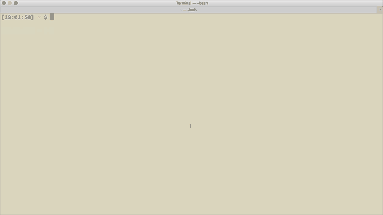

# Using a custom authorizer

This example shows how to configure and use a custom authorizer. This is a trivially simple authorizer that just checks for anything in the `Authorization` header. It expects the header to contain a username and a access key/password separated by a dash. 

## Prerequisites

Custom authorizer support requires `claudia-api-builder` 1.6.0, and `claudia 1.7.0`

## Setting it up

Follow these steps:

* `npm install` to grab the dependencies
* `npm run create-authorizer` to set up a new Lambda function for the authorizer
* `npm run create-api` to set up the REST API using the custom authorizer

## Trying it out

Grab the URL of your API (printed by the `create-api` step), and execute using CURL:

* the root resource has no authorizer attached, so you should be able to directly call it without the `Authorization` header
* the `/locked` GET resource has an authorizer, but the authorizer policy won't allow access to any user. Try it with and without the `Authorization` header and see the difference in results
* the `/unlocked` GET resource has an authorizer, and the authorizer policy allows access to any user. It will print the user ID (first part of the header, before a dash). Try it with and without an authorization header to see the different results.

## How it works

Check out the [authorizer.js](authorizer.js) to see the implementation of the trivial authorizer. Then see [index.js](index.js) for how this authorizer is used in the API Gateway.
