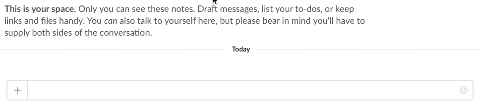

# Slack slash commands with delayed responses

This example project shows how to implement delayed responses to Slack slash commands. Slack limits the time to the first response to 3 seconds, so if you're trying to run a longer task, implementing everything in a single response won't work. 

Slack Slash commands support delayed and multiple responses, allowing a bot to respond to a command up to 5 times in 30 minutes.

_Claudia Bot Builder_, since 1.4.0, offers a simple solution for delayed responses. This project demonstrates how to do that by implementing a simple alert timer. You can tell it how many seconds to wait, and it will ping you after that period.

## How to run it

1. Run `npm install` to grab all the dependencies
2. Run `npm run create` to set up a Lambda function, and follow the instructions to connect it to Slack. (Refer to [Setting up a Slack Slash Command](https://github.com/claudiajs/claudia-bot-builder/blob/master/docs/GETTING_STARTED.md#slack-app-slash-command-configuration) if you need more info)
3. In your Slack channel, Run `/delay 10` 

You'll see an immediate response that the timer is scheduled, and a delayed response 10 seconds later.

 

 

## How it works

The code is in [bot.js](bot.js).

Check out the [Delayed Responses to Slack Slash Commands](https://claudiajs.com/tutorials/slack-delayed-responses.html) Tutorial for a detailed explanation of how this code works.

## More information

Check out the [Slack API Docs](https://api.slack.com/slash-commands#responding_to_a_command) for more information on delayed responses, and Claudia API Builder [API Docs](https://github.com/claudiajs/claudia-api-builder/blob/master/docs/api.md#intercepting-requests) for more information on intercepting requests.
